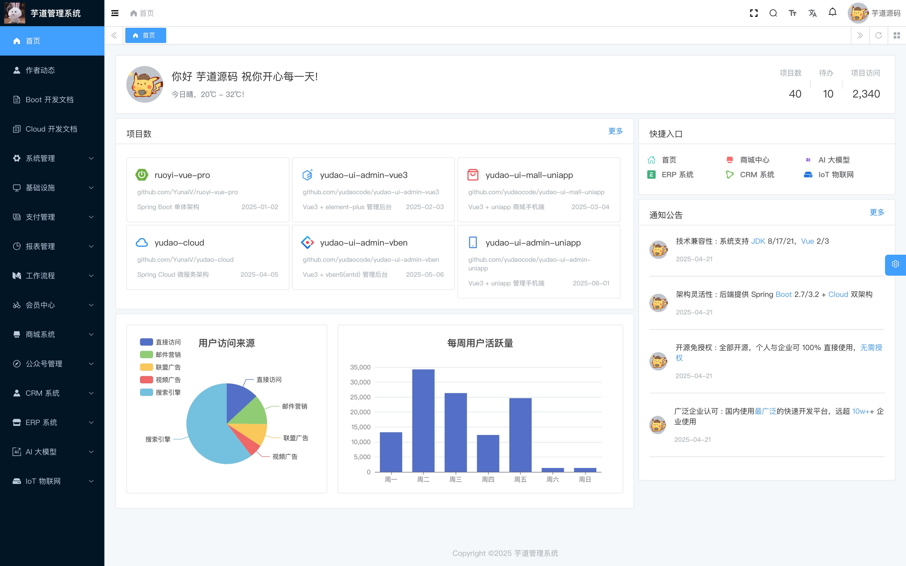
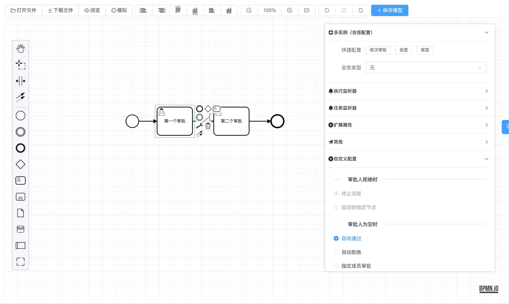
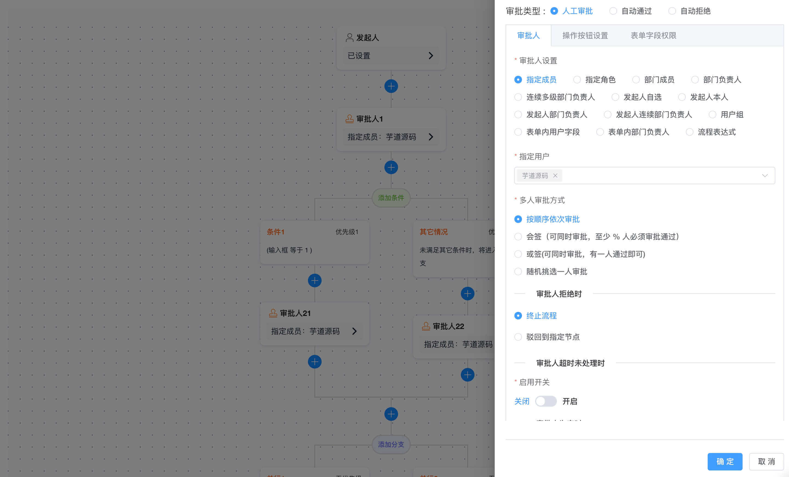

# 功能代码质量与规范审查报告

- **生成时间**：2026-09-25 20:15:00
- **报告归档路径**：`reports/review_report_task_system_20260925_201500.md`

---

## 一、审查概览

- **审查项目**：`cjx/ruoyi-vue-pro-master-jdk17`
- **目标功能**：在 yudao 框架下实现简易人员管理与任务报名系统（人员管理、任务管理、报名管理）
- **关联代码范围**：
  - **控制层 (Controller)**：
    - `yudao-module-task/.../controller/admin/person/PersonController.java`
    - `yudao-module-task/.../controller/admin/tasks/TasksController.java`
    - `yudao-module-task/.../controller/admin/sign/SignController.java`
    - `yudao-module-task/.../controller/admin/signrecord/SignRecordController.java`
  - **业务层 (Service)**：
    - `yudao-module-task/.../service/person/PersonService.java` & `PersonServiceImpl.java`
    - `yudao-module-task/.../service/tasks/TasksService.java` & `TasksServiceImpl.java`
    - `yudao-module-task/.../service/sign/SignService.java` & `SignServiceImpl.java`
    - `yudao-module-task/.../service/signrecord/SignRecordService.java` & `SignRecordServiceImpl.java`
  - **持久层 (Mapper/DAO/XML)**：
    - `yudao-module-task/.../dal/mysql/person/PersonMapper.java`
    - `yudao-module-task/.../dal/mysql/tasks/TasksMapper.java`
    - `yudao-module-task/.../dal/mysql/sign/SignMapper.java`
    - `yudao-module-task/.../dal/mysql/signrecord/SignRecordMapper.java`
    - 各对应 Mapper XML（`mapper/person/PersonMapper.xml` 等）
  - **数据传输与实体 (DTO/VO/DO)**：
    - `PersonDO.java`, `TasksDO.java`, `SignDO.java`, `SignRecordDO.java`
    - `PersonSaveReqVO.java`, `PersonRespVO.java`, `TasksSaveReqVO.java`, `TasksRespVO.java`, `SignRespVO.java`, `SignRecordRespVO.java`
  - **定时任务与枚举 (Job/Enums)**：
    - `TaskExpireJob.java`
    - `TaskStatusEnum.java`, `TaskSignStatusEnum.java`, `TaskTopFlagEnum.java`, `SignRecordStatusEnum.java`, `ErrorCodeConstants.java`
  - **数据库脚本**：
    - `sql/mysql/task_module.sql`, `sql/mysql/ruoyi-vue-pro.sql`
- **缺陷统计**：**P0: 0 处** ｜ **P1: 4 处** ｜ **P2: 5 处** ｜ **P3: 3 处**
- **综合评级**：🟠 **待改进 (无 P0, P1 > 2)**

---

## 二、规范符合度与问题量化矩阵

| 规范与审查维度 | 判定状态 | 违规数量统计 (P0/P1/P2/P3) | 核心问题摘要 |
| :--- | :---: | :---: | :--- |
| **1. 禁止魔法值** | 🟡 部分违规 | P0: 0, P1: 0, P2: 1, P3: 0 | 状态枚举覆盖较全，但百分比计算存在硬编码倍率数字（`100` / `100.0`） |
| **2. 分层调用与查询规范** | 🔴 严重违规 | P0: 0, P1: 1, P2: 1, P3: 0 | `SignServiceImpl` 跨服务直连 `TasksMapper`/`PersonMapper` 破坏分层；统计查询拉取全量到内存处理 |
| **3. 异常与日志处理规范** | 🟡 部分违规 | P0: 0, P1: 0, P2: 1, P3: 1 | 错误码集中管理，但定时任务无事务回滚保障，个别服务缺少排障日志 |
| **4. 基础代码设计与健壮性** | 🔴 严重风险 | P0: 0, P1: 3, P2: 3, P3: 2 | 报名存在高并发超卖/锁冲突缺陷；人员 VO 丢失账号密码入参；时间无前后校验；级联删除不完整 |

---

## 三、违规与代码质量问题明细

### 1. 魔法值问题

- **[P2 - 一般] 发现位置**：`yudao-module-task/.../service/sign/SignServiceImpl.java` (L274-L279)
  - **问题代码**：
    ```java
    private Integer calcPercent(int personSum, int personMax) {
        if (personMax <= 0) {
            return 0;
        }
        return Math.min(100, (int) Math.round(personSum * 100.0 / personMax));
    }
    ```
  - **问题分析**：计算百分比时直接硬编码了数字字面量 `100` 与 `100.0`，违背了“禁止魔法值”规范中对计算倍率与上限数值的抽取要求。
  - **修复建议**：在常量类（如 `TaskConstants`）中抽取 `PERCENT_BASE = 100.0` 与 `MAX_PERCENT = 100`。

---

### 2. 分层调用与查询规范问题

- **[P1 - 严重] 发现位置**：`yudao-module-task/.../service/sign/SignServiceImpl.java` (L50, L59) & `SignRecordServiceImpl.java` (L37, L40)
  - **问题代码**：
    ```java
    // SignServiceImpl.java
    @Resource
    private PersonMapper personMapper;

    /**
     * 直接使用任务模块的 Mapper 读取任务，而不是注入 TasksService。
     * 原因是 TasksServiceImpl 需要反向调用本类的 validateQuotaNotLessThanSigned，
     * 若这里再依赖 TasksService 会形成循环依赖，导致 Spring 启动失败
     */
    @Resource
    private TasksMapper tasksMapper;
    ```
  - **问题分析**：
    1. `SignServiceImpl` 与 `SignRecordServiceImpl` 绕过了 `TasksService` 与 `PersonService`，跨领域直接注入并操作持久层 Mapper。
    2. 产生该设计的根本原因是 `TasksServiceImpl` 与 `SignServiceImpl` 双向依赖。开发者为了规避 Spring 循环依赖，粗暴将调用下沉直连 Mapper，严重破坏了领域边界与分层架构规范。
  - **修复建议**：
    - 解耦校验逻辑：将 `validateQuotaNotLessThanSigned` 下沉至专门的领域校验器，或由 `TasksServiceImpl` 通过事件/发布订阅解耦，使服务依赖变为单向依赖（`SignService -> TasksService`）。

- **[P2 - 一般] 发现位置**：`yudao-module-task/.../dal/mysql/signrecord/SignRecordMapper.java` (L53-L61)
  - **问题代码**：
    ```java
    default Map<Long, Long> selectSignedCountMapByTaskIds(Collection<Long> taskIds) {
        if (CollUtil.isEmpty(taskIds)) {
            return Collections.emptyMap();
        }
        List<SignRecordDO> list = selectList(new LambdaQueryWrapperX<SignRecordDO>()
                .in(SignRecordDO::getTaskId, taskIds)
                .eq(SignRecordDO::getStatus, SignRecordStatusEnum.SIGNED.getStatus()));
        return list.stream().collect(Collectors.groupingBy(SignRecordDO::getTaskId, Collectors.counting()));
    }
    ```
  - **问题分析**：为了回避编写原生 SQL/XML，代码将指定任务下的**全量明细记录**全部查询加载到 JVM 堆内存中，再通过 Java Stream 进行计数统计。在数据量增大时（例如数万条报名明细），将极易引发频繁 GC 甚至 OOM 内存溢出。
  - **修复建议**：遵循“SQL 与 XML 用于复杂统计分析”的规范，在 XML 中编写 `SELECT task_id, count(1) AS count FROM task_sign_record WHERE status = 0 AND task_id IN (...) GROUP BY task_id`，或使用 MyBatis-Plus 的 `selectMaps` 完成数据库层面的聚合统计。

---

### 3. 异常与日志处理问题

- **[P2 - 一般] 发现位置**：`yudao-module-task/.../service/tasks/TasksServiceImpl.java` (L132-L146)
  - **问题代码**：
    ```java
    @Override
    public int expireTasks() {
        List<TasksDO> tasks = tasksMapper.selectListByStatusAndEndTimeLt(
                TaskStatusEnum.PUBLISHED.getStatus(), LocalDateTime.now());
        if (CollUtil.isEmpty(tasks)) {
            return 0;
        }
        tasks.forEach(task -> {
            TasksDO updateObj = new TasksDO();
            updateObj.setId(task.getId());
            updateObj.setStatus(TaskStatusEnum.FINISHED.getStatus());
            tasksMapper.updateById(updateObj);
        });
        log.info("[expireTasks][将 {} 个已超截止时间的任务置为已结束]", tasks.size());
        return tasks.size();
    }
    ```
  - **问题分析**：
    1. 批量任务流转操作没有声明 `@Transactional` 注解，中途若单条更新发生异常，会导致部分任务流转成功、部分失败，缺乏事务一致性。
    2. 采用内存遍历 + 循环逐条 `updateById`（N+1 更新），在大批量数据下对数据库造成巨大压力。
  - **修复建议**：添加 `@Transactional(rollbackFor = Exception.class)`，并重构为批量更新 SQL：`UPDATE task_tasks SET status = 2 WHERE status = 1 AND end_time < NOW()`。

- **[P3 - 建议] 发现位置**：`yudao-module-task/.../service/signrecord/SignRecordServiceImpl.java`
  - **问题分析**：类中完全没有引入 `@Slf4j`，关键业务查询与处理过程缺少追踪日志，不符合日志规范。

---

### 4. 业务需求实现与基础健壮性缺陷

- **[P1 - 严重] 核心需求缺失：人员录入缺失账号与密码字段**
  - **发现位置**：`PersonSaveReqVO.java` (L10-L28) & `PersonServiceImpl.java` (L203-L208)
  - **问题分析**：
    需求明确要求：“**人员信息包括：姓名、电话号码、出生年月、账号、密码**。新增人员时，需同步创建可用于登录的账号”。
    但在 `PersonSaveReqVO` 中仅声明了 `name`, `number`, `birthday` 3 个输入字段，**直接缺失了 `username` 与 `password`**！
    实现代码在 `PersonServiceImpl` 中直接强行使用 `mobile` 作为用户名、使用写死的默认密码 `admin123`，管理员无法按需求输入指定账号和密码，功能实现残缺。
  - **修复建议**：在 `PersonSaveReqVO` 中补充 `username` 和 `password` 字段，并在新增时将输入值传入 `AdminUserCreateReqDTO`。

- **[P1 - 严重] 高并发竞态缺陷：报名超卖（名额击穿）与唯一索引冲突**
  - **发现位置**：`yudao-module-task/.../service/sign/SignServiceImpl.java` (L128-L208)
  - **问题分析**：
    1. **并发超卖（Check-Then-Act）**：`doJoin` 中先通过 `selectSignedCountByTaskId` 检查名额，随后插入明细。在 MySQL 默认的 RR（可重复读）隔离级别下，多事务并发操作时采用快照读，两个并发请求读取的报名数相同，后续插入均成功；后置的 `if (signedCount > personMax)` 在各自事务内依然是快照读，根本无法读到并发事务的数据，最终导致报名总人数突破 `quota` 限制，产生超卖。
    2. **懒插入并发冲突**：`refreshSignProgress` 在任务首次有人报名时执行 `selectByTaskId` 为空即 `insert`。多线程并发接取时会同时执行 `insert`，直接触发底层 `task_sign.uk_task_id` 唯一索引冲突异常（500 报错），且无重试与捕获保护。
  - **修复建议**：
    - 针对任务名额扣减，采用乐观锁原子更新（`UPDATE task_sign SET person_sum = person_sum + 1 WHERE task_id = ? AND person_sum < person_max`），或者在任务发布时即初始化 `task_sign` 行，报名时对 `task_sign` 加排他行锁（`SELECT FOR UPDATE`）或分布式锁。

- **[P1 - 严重] 任务开始与截止时间倒挂**
  - **发现位置**：`yudao-module-task/.../controller/admin/tasks/vo/TasksSaveReqVO.java`
  - **问题分析**：`startTime` 与 `endTime` 仅添加了非空校验，未校验 `startTime.isBefore(endTime)`。前端或 API 调用可随意录入截止时间早于开始时间的不合法数据。
  - **修复建议**：在 Service 层的 `createTask`/`updateTask` 中增加业务规则校验，或在 VO 上使用自定义校验器。

- **[P2 - 一般] 级联删除与数据生命周期未闭环**
  - **发现位置**：`TasksServiceImpl.deleteTask` (L71-L76) & `PersonServiceImpl.deletePerson` (L84-L89)
  - **问题分析**：
    1. 删除任务时，未校验当前是否已有人员报名，且未级联删除或归档 `task_sign` 与 `task_sign_record`，留下大量孤儿数据。
    2. 删除任务人员时，仅删除了 `task_user` 记录，对应的系统账号（`system_users`）及角色授权仍然残留且处于启用状态，存在安全隐患。
  - **修复建议**：删除任务前增加“存在有效报名记录不允许删除”的校验；删除人员时同步停用系统账号并解除角色授权。

- **[P2 - 一般] 接口路由命名不规范**
  - **发现位置**：`TasksController.java` (L32)
  - **问题分析**：类级别路由注解为 `@RequestMapping("/task/s")`，URL 路径出现怪异的 `/task/s/create`、`/task/s/page`，严重违背 RESTful 风格与系统命名规范。
  - **修复建议**：规范调整为 `@RequestMapping("/task/tasks")` 或 `@RequestMapping("/task/task")`。

- **[P3 - 建议] 缺少手机号格式强校验**
  - **发现位置**：`PersonSaveReqVO.java` (L21-L22)
  - **问题分析**：`number` 字段仅有 `@NotEmpty`，未校验 11 位中国大陆手机号正则表达式。

- **[P3 - 建议] 单元测试覆盖率为零**
  - **发现位置**：`yudao-module-task` 根目录
  - **问题分析**：模块内未编写任何单元测试（甚至不存在 `src/test` 目录），核心业务逻辑（尤其是报名、发布流转、名额扣减）均未获得自动化测试保护。

---


## 四、优化重构代码示例 (Refactoring Diff)

### 示例 1：`PersonSaveReqVO` 补齐账号密码需求输入

**重构前 (Before)**：
```java
public class PersonSaveReqVO {
    private Long id;
    @NotEmpty(message = "姓名不能为空")
    private String name;
    @NotEmpty(message = "电话号码不能为空")
    private String number;
    @NotNull(message = "出生年月不能为空")
    private LocalDate birthday;
}
```

**重构后 (After)**：
```java
public class PersonSaveReqVO {
    private Long id;

    @Schema(description = "姓名", requiredMode = Schema.RequiredMode.REQUIRED, example = "张三")
    @NotEmpty(message = "姓名不能为空")
    private String name;

    @Schema(description = "电话号码", requiredMode = Schema.RequiredMode.REQUIRED, example = "13800138000")
    @NotEmpty(message = "电话号码不能为空")
    @Pattern(regexp = "^1[3-9]\\d{9}$", message = "手机号码格式不正确")
    private String number;

    @Schema(description = "出生年月", requiredMode = Schema.RequiredMode.REQUIRED, example = "1998-05-20")
    @NotNull(message = "出生年月不能为空")
    private LocalDate birthday;

    @Schema(description = "登录账号", requiredMode = Schema.RequiredMode.REQUIRED, example = "zhangsan")
    @NotEmpty(message = "登录账号不能为空")
    @Pattern(regexp = "^[a-zA-Z0-9_]{4,16}$", message = "账号必须为4-16位字母、数字或下划线")
    private String username;

    @Schema(description = "登录密码（新增时必填）", example = "123456")
    private String password;
}
```

---

### 示例 2：`SignServiceImpl.doJoin` 并发安全与分层解耦重构

**重构前 (Before)**：
```java
// 跨层直连 tasksMapper、先查后验在 RR 下并发失效导致超卖
private void doJoin(Long taskId, Long personId) {
    TasksDO task = validateTaskSignable(taskId);
    if (signRecordMapper.selectSignedCountByTaskId(taskId) >= task.getQuota()) {
        throw exception(SIGN_TASK_FULL);
    }
    // ... 插入明细
    refreshSignProgress(task); // 快照读判断 signedCount > personMax 无法防超卖
}
```

**重构后 (After)**：
```java
@Resource
private TasksService tasksService; // 注入 Service 保证分层规范

@Transactional(rollbackFor = Exception.class)
public void joinTask(Long taskId) {
    Long personId = getLoginPerson().getId();
    TasksDO task = tasksService.validateTaskSignable(taskId);

    // 1. 原子扣减名额 / 状态乐观锁更新（防止并发超卖）
    int updatedRows = signMapper.incrementPersonSumIfAvailable(taskId);
    if (updatedRows == 0) {
        throw exception(SIGN_TASK_FULL);
    }

    // 2. 插入或复活报名明细
    SignRecordDO record = signRecordMapper.selectByTaskIdAndPersonId(taskId, personId);
    if (record == null) {
        signRecordMapper.insert(SignRecordDO.builder()
                .taskId(taskId).personId(personId)
                .signTime(LocalDateTime.now())
                .status(SignRecordStatusEnum.SIGNED.getStatus())
                .build());
    } else {
        if (SignRecordStatusEnum.isSigned(record.getStatus())) {
            throw exception(SIGN_RECORD_DUPLICATE);
        }
        signRecordMapper.updateById(SignRecordDO.builder()
                .id(record.getId())
                .status(SignRecordStatusEnum.SIGNED.getStatus())
                .signTime(LocalDateTime.now())
                .build());
    }
    log.info("[joinTask][任务({}) 人员({}) 报名成功]", taskId, personId);
}
```

---

## 五、总结与建议

1. **阻断合入项 (P1 级)**：
   - **人员管理**：`PersonSaveReqVO` 必须补充账号 (`username`) 和密码 (`password`) 字段，并接入参数校验与系统用户同步创建逻辑。
   - **并发安全**：重构报名核心逻辑，使用数据库原子更新条件（`person_sum < person_max`）或排他行锁，彻底根除高并发超卖与唯一索引报错风险。
   - **架构解耦**：消除 `SignServiceImpl` 与 `TasksServiceImpl` 的双向依赖与跨层直连持久层反模式。
   - **业务约束**：增加任务开始时间早于截止时间的校验（`startTime < endTime`）。

2. **优化改进项 (P2/P3 级)**：
   - 将内存全量 Stream 计数重构为 SQL `GROUP BY` 聚合查询。
   - 完善任务与人员删除时的关联数据完整性校验。
   - 修正怪异的 Controller 路由命名 `/task/s` 为规范的 `/task/tasks`。
   - 为模块补齐基础单元测试（覆盖发布流转、并发报名等高频分支）。


**严肃声明：现在、未来都不会有商业版本，所有代码全部开源!！**

**「我喜欢写代码，乐此不疲」**  
**「我喜欢做开源，以此为乐」**

我 🐶 在上海艰苦奋斗，早中晚在 top3 大厂认真搬砖，夜里为开源做贡献。

如果这个项目让你有所收获，记得 Star 关注哦，这对我是非常不错的鼓励与支持。

## 🐶 新手必读

* nodejs > 16.18.0 && pnpm > 8.6.0 (强制使用pnpm)
* 演示地址【Vue3 + element-plus】：<http://dashboard-vue3.yudao.iocoder.cn>
* 演示地址【Vue3 + vben5.0(ant-design-vue)】：<http://dashboard-vben.yudao.iocoder.cn>
* 演示地址【Vue2 + element-ui】：<http://dashboard.yudao.iocoder.cn>
* 启动文档：<https://doc.iocoder.cn/quick-start/>
* 视频教程：<https://doc.iocoder.cn/video/>

## 🐯 平台简介

**芋道**，以开发者为中心，打造中国第一流的快速开发平台，全部开源，个人与企业可 100% 免费使用。

* 采用 [vue-element-plus-admin](https://gitee.com/kailong110120130/vue-element-plus-admin) 实现
* 改换 saas，自动引入等功能
* 使用 Element Plus 免费开源的中后台模版，具备如下特性：



* **最新技术栈**：使用 Vue3、Vite4 等前端前沿技术开发
* **TypeScript**: 应用程序级 JavaScript 的语言
* **主题**: 可配置的主题
* **国际化**：内置完善的国际化方案
* **权限**：内置完善的动态路由权限生成方案
* **组件**：二次封装了多个常用的组件
* **示例**：内置丰富的示例

## 技术栈

| 框架                                                                   | 说明               | 版本     |
|----------------------------------------------------------------------|------------------|--------|
| [Vue](https://staging-cn.vuejs.org/)                                 | Vue 框架           | 3.3.8  |
| [Vite](https://cn.vitejs.dev//)                                      | 开发与构建工具          | 4.5.0  |
| [Element Plus](https://element-plus.org/zh-CN/)                      | Element Plus     | 2.4.2  |
| [TypeScript](https://www.typescriptlang.org/docs/)                   | JavaScript 的超集   | 5.2.2  |
| [pinia](https://pinia.vuejs.org/)                                    | Vue 存储库 替代 vuex5 | 2.1.7  |
| [vueuse](https://vueuse.org/)                                        | 常用工具集            | 10.6.1 |
| [vue-i18n](https://kazupon.github.io/vue-i18n/zh/introduction.html/) | 国际化              | 9.6.5  |
| [vue-router](https://router.vuejs.org/)                              | Vue 路由           | 4.2.5  |
| [unocss](https://uno.antfu.me/)                                      | 原子 css           | 0.57.4 |
| [iconify](https://icon-sets.iconify.design/)                         | 在线图标库            | 3.1.1  |
| [wangeditor](https://www.wangeditor.com/)                            | 富文本编辑器           | 5.1.23 |

## 开发工具

推荐 VS Code 开发，配合插件如下：

| 插件名                           | 功能                  |
|-------------------------------|---------------------|
| Vue - Official                | Vue 与 TypeScript 支持 |
| unocss                        | unocss for vscode   |
| Iconify IntelliSense          | Iconify 预览和搜索       |
| i18n Ally                     | 国际化智能提示             |
| Stylelint                     | Css    格式化          |
| Prettier                      | 代码格式化               |
| ESLint                        | 脚本代码检查              |
| DotENV                        | env 文件高亮            |

## 🔥 后端架构

支持 Spring Boot、Spring Cloud 两种架构：

① Spring Boot 单体架构：<https://doc.iocoder.cn>


② Spring Cloud 微服务架构：<https://cloud.iocoder.cn>


## 内置功能

系统内置多种多种业务功能，可以用于快速你的业务系统：

系统内置多种多种业务功能，可以用于快速你的业务系统：


* 通用模块（必选）：系统功能、基础设施
* 通用模块（可选）：工作流程、支付系统、数据报表、会员中心
* 业务系统（按需）：Mall 电子商城、OA 办公自动化、ERP 企业资源计划系统、WMS 仓库管理系统、CRM 客户关系管理、CMS 内容管理系统、MES 执行制造系统、HRM 人力资源管理、FMS 财务管理、PMS 项目管理、AI 大模型平台、IoT 物联网系统、IM 即时通讯系统、Mobile 手机移动端、Report 数据大屏

### 系统功能

|     | 功能    | 描述                              |
|-----|-------|---------------------------------|
|     | 用户管理  | 用户是系统操作者，该功能主要完成系统用户配置          |
| ⭐️  | 在线用户  | 当前系统中活跃用户状态监控，支持手动踢下线           |
|     | 角色管理  | 角色菜单权限分配、设置角色按机构进行数据范围权限划分      |
|     | 菜单管理  | 配置系统菜单、操作权限、按钮权限标识等，本地缓存提供性能    |
|     | 部门管理  | 配置系统组织机构（公司、部门、小组），树结构展现支持数据权限  |
|     | 岗位管理  | 配置系统用户所属担任职务                    |
| 🚀  | 租户管理  | 配置系统租户，支持 SaaS 场景下的多租户功能        |
| 🚀  | 租户套餐  | 配置租户套餐，自定每个租户的菜单、操作、按钮的权限       |
|     | 字典管理  | 对系统中经常使用的一些较为固定的数据进行维护          |
| 🚀  | 短信管理  | 短信渠道、短息模板、短信日志，对接阿里云、腾讯云等主流短信平台 |
| 🚀  | 邮件管理  | 邮箱账号、邮件模版、邮件发送日志，支持所有邮件平台       |
| 🚀  | 站内信   | 系统内的消息通知，提供站内信模版、站内信消息          |
| 🚀  | 操作日志  | 系统正常操作日志记录和查询，集成 Swagger 生成日志内容 |
| ⭐️  | 登录日志  | 系统登录日志记录查询，包含登录异常               |
| 🚀  | 错误码管理 | 系统所有错误码的管理，可在线修改错误提示，无需重启服务     |
|     | 通知公告  | 系统通知公告信息发布维护                    |
| 🚀  | 敏感词   | 配置系统敏感词，支持标签分组                  |
| 🚀  | 应用管理  | 管理 SSO 单点登录的应用，支持多种 OAuth2 授权方式 |
| 🚀  | 地区管理  | 展示省份、城市、区镇等城市信息，支持 IP 对应城市      |


### 工作流程


基于 Flowable 构建，可支持信创（国产）数据库，满足中国特色流程操作：

| BPMN 设计器                    | 钉钉/飞书设计器                      |
|-----------------------------|-------------------------------|
|  |  |

> 历经头部企业生产验证，工作流引擎须标配仿钉钉/飞书 + BPMN 双设计器！！！
>
> 前者支持轻量配置简单流程，后者实现复杂场景深度编排

| 功能列表       | 功能描述                                                                                | 是否完成 |
|------------|-------------------------------------------------------------------------------------|------|
| SIMPLE 设计器 | 仿钉钉/飞书设计器，支持拖拽搭建表单流程，10 分钟快速完成审批流程配置                                                | ✅    |
| BPMN 设计器   | 基于 BPMN 标准开发，适配复杂业务场景，满足多层级审批及流程自动化需求                                               | ✅    |
| 会签         | 同一个审批节点设置多个人（如 A、B、C 三人，三人会同时收到待办任务），需全部同意之后，审批才可到下一审批节点                            | ✅    |
| 或签         | 同一个审批节点设置多个人，任意一个人处理后，就能进入下一个节点                                                     | ✅    |
| 依次审批       | （顺序会签）同一个审批节点设置多个人（如 A、B、C 三人），三人按顺序依次收到待办，即 A 先审批，A 提交后 B 才能审批，需全部同意之后，审批才可到下一审批节点 | ✅    |
| 抄送         | 将审批结果通知给抄送人，同一个审批默认排重，不重复抄送给同一人                                                     | ✅    |
| 驳回         | （退回）将审批重置发送给某节点，重新审批。可驳回至发起人、上一节点、任意节点                                              | ✅    |
| 转办         | A 转给其 B 审批，B 审批后，进入下一节点                                                             | ✅    |
| 委派         | A 转给其 B 审批，B 审批后，转给 A，A 继续审批后进入下一节点                                                 | ✅    |
| 加签         | 允许当前审批人根据需要，自行增加当前节点的审批人，支持向前、向后加签                                                  | ✅    |
| 减签         | （取消加签）在当前审批人操作之前，减少审批人                                                              | ✅    |
| 撤销         | （取消流程）流程发起人，可以对流程进行撤销处理                                                             | ✅    |
| 终止         | 系统管理员，在任意节点终止流程实例                                                                   | ✅    |
| 表单权限       | 支持拖拉拽配置表单，每个审批节点可配置只读、编辑、隐藏权限                                                       | ✅    |
| 超时审批       | 配置超时审批时间，超时后自动触发审批通过、不通过、驳回等操作                                                      | ✅    |
| 自动提醒       | 配置提醒时间，到达时间后自动触发短信、邮箱、站内信等通知提醒，支持自定义重复提醒频次                                          | ✅    |
| 父子流程       | 主流程设置子流程节点，子流程节点会自动触发子流程。子流程结束后，主流程才会执行（继续往下下执行），支持同步子流程、异步子流程                      | ✅    |
| 条件分支       | （排它分支）用于在流程中实现决策，即根据条件选择一个分支执行                                                      | ✅    |
| 并行分支       | 允许将流程分成多条分支，不进行条件判断，所有分支都会执行                                                        | ✅    |
| 包容分支       | （条件分支 + 并行分支的结合体）允许基于条件选择多条分支执行，但如果没有任何一个分支满足条件，则可以选择默认分支                           | ✅    |
| 路由分支       | 根据条件选择一个分支执行（重定向到指定配置节点），也可以选择默认分支执行（继续往下执行）                                        | ✅    |
| 触发节点       | 执行到该节点，触发 HTTP 请求、HTTP 回调、更新数据、删除数据等                                                | ✅    |
| 延迟节点       | 执行到该节点，审批等待一段时间再执行，支持固定时长、固定日期等                                                     | ✅    |
| 拓展设置       | 流程前置/后置通知，节点（任务）前置、后置通知，流程报表，自动审批去重，自定流程编号、标题、摘要，流程报表等                              | ✅    |

### 支付系统

|     | 功能   | 描述                        |
|-----|------|---------------------------|
| 🚀  | 应用信息 | 配置商户的应用信息，对接支付宝、微信等多个支付渠道 |
| 🚀  | 支付订单 | 查看用户发起的支付宝、微信等的【支付】订单     |
| 🚀  | 退款订单 | 查看用户发起的支付宝、微信等的【退款】订单     |
| 🚀  | 回调通知 | 查看支付回调业务的【支付】【退款】的通知结果    |
| 🚀  | 接入示例 | 提供接入支付系统的【支付】【退款】的功能实战    |

### 基础设施

|     | 功能        | 描述                                           |
|-----|-----------|----------------------------------------------|
| 🚀  | 代码生成      | 前后端代码的生成（Java、Vue、SQL、单元测试），支持 CRUD 下载       |
| 🚀  | 系统接口      | 基于 Swagger 自动生成相关的 RESTful API 接口文档          |
| 🚀  | 数据库文档     | 基于 Screw 自动生成数据库文档，支持导出 Word、HTML、MD 格式      |
|     | 表单构建      | 拖动表单元素生成相应的 HTML 代码，支持导出 JSON、Vue 文件         |
| 🚀  | 配置管理      | 对系统动态配置常用参数，支持 SpringBoot 加载                 |
| ⭐️  | 定时任务      | 在线（添加、修改、删除)任务调度包含执行结果日志                     |
| 🚀  | 文件服务      | 支持将文件存储到 S3（MinIO、阿里云、腾讯云、七牛云）、本地、FTP、数据库等   | 
| 🚀  | WebSocket | 提供 WebSocket 接入示例，支持一对一、一对多发送方式              | 
| 🚀  | API 日志    | 包括 RESTful API 访问日志、异常日志两部分，方便排查 API 相关的问题   |
|     | MySQL 监控  | 监视当前系统数据库连接池状态，可进行分析SQL找出系统性能瓶颈              |
|     | Redis 监控  | 监控 Redis 数据库的使用情况，使用的 Redis Key 管理           |
| 🚀  | 消息队列      | 基于 Redis 实现消息队列，Stream 提供集群消费，Pub/Sub 提供广播消费 |
| 🚀  | Java 监控   | 基于 Spring Boot Admin 实现 Java 应用的监控           |
| 🚀  | 链路追踪      | 接入 SkyWalking 组件，实现链路追踪                      |
| 🚀  | 日志中心      | 接入 SkyWalking 组件，实现日志中心                      |
| 🚀  | 服务保障      | 基于 Redis 实现分布式锁、幂等、限流功能，满足高并发场景              |
| 🚀  | 日志服务      | 轻量级日志中心，查看远程服务器的日志                           |
| 🚀  | 单元测试      | 基于 JUnit + Mockito 实现单元测试，保证功能的正确性、代码的质量等    |


### 数据报表

|     | 功能    | 描述                 |
|-----|-------|--------------------|
| 🚀  | 报表设计器 | 支持数据报表、图形报表、打印设计等  |
| 🚀  | 大屏设计器 | 拖拽生成数据大屏，内置几十种图表组件 |

### 微信公众号

|    | 功能     | 描述                            |
|----|--------|-------------------------------|
| 🚀 | 账号管理   | 配置接入的微信公众号，可支持多个公众号           |
| 🚀 | 数据统计   | 统计公众号的用户增减、累计用户、消息概况、接口分析等数据  |
| 🚀 | 粉丝管理   | 查看已关注、取关的粉丝列表，可对粉丝进行同步、打标签等操作 |
| 🚀 | 消息管理   | 查看粉丝发送的消息列表，可主动回复粉丝消息         |
| 🚀 | 模版消息   | 配置和发送模版消息，用于向粉丝推送通知类消息        |
| 🚀 | 自动回复   | 自动回复粉丝发送的消息，支持关注回复、消息回复、关键字回复 |
| 🚀 | 标签管理   | 对公众号的标签进行创建、查询、修改、删除等操作       |
| 🚀 | 菜单管理   | 自定义公众号的菜单，也可以从公众号同步菜单         |
| 🚀 | 素材管理   | 管理公众号的图片、语音、视频等素材，支持在线播放语音、视频 |
| 🚀 | 图文草稿箱  | 新增常用的图文素材到草稿箱，可发布到公众号         |
| 🚀 | 图文发表记录 | 查看已发布成功的图文素材，支持删除操作           |

### 商城系统

演示地址：<https://doc.iocoder.cn/mall-preview/>


### 会员中心

|     | 功能   | 描述                               |
|-----|------|----------------------------------|
| 🚀  | 会员管理 | 会员是 C 端的消费者，该功能用于会员的搜索与管理        |
| 🚀  | 会员标签 | 对会员的标签进行创建、查询、修改、删除等操作           |
| 🚀  | 会员等级 | 对会员的等级、成长值进行管理，可用于订单折扣等会员权益      |
| 🚀  | 会员分组 | 对会员进行分组，用于用户画像、内容推送等运营手段         |
| 🚀  | 积分签到 | 回馈给签到、消费等行为的积分，会员可订单抵现、积分兑换等途径消耗 |

### ERP 系统

演示地址：<https://doc.iocoder.cn/erp-preview/>


### WMS 系统

演示地址：<https://doc.iocoder.cn/wms-preview/>


### CRM 系统

演示地址：<https://doc.iocoder.cn/crm-preview/>


### MES 系统

演示地址：<https://doc.iocoder.cn/mes-preview/>


### HRM 人力资源管理系统

演示地址：<https://doc.iocoder.cn/hrm-preview/>


### FMS 财务管理系统

演示地址：<https://doc.iocoder.cn/fms-preview/>


### PMS 项目管理系统

演示地址：<https://doc.iocoder.cn/pms-preview/>


### AI 大模型

演示地址：<https://doc.iocoder.cn/ai-preview/>


### MES 系统

演示地址：<https://doc.iocoder.cn/mes-preview/>


### IoT 物联网

演示地址：<https://doc.iocoder.cn/iot/build>


### IM 即时通讯

演示地址（Vue3 + Element Plus）：<http://dashboard-vue3.yudao.iocoder.cn>

使用文档：<https://doc.iocoder.cn/im-preview/>


| 聊天界面 | 聊天管理 |
| --- | --- |
|  |  |

## 🐷 演示图

### 系统功能

| 模块       | biu                         | biu                       | biu                      |
|----------|-----------------------------|---------------------------|--------------------------|
| 登录 & 首页  |        |      |  |
| 用户 & 应用  |    |  |  |
| 租户 & 套餐  |    |  | -                        |
| 部门 & 岗位  |    |  | -                        |
| 菜单 & 角色  |    |  | -                        |
| 审计日志     |    |  | -                        |
| 短信       |    |  |  |
| 字典 & 敏感词 |    |  |   |
| 错误码 & 通知 |  |  | -                        |

### 工作流程

| 模块      | biu                             | biu                             | biu                             |
|---------|---------------------------------|---------------------------------|---------------------------------|
| 流程模型    |  |  |  |
| 表单 & 分组 |        |        | -                               |
| 我的流程    |  |  |  |
| 待办 & 已办 |  |  |  |
| OA 请假   |  |  |  |

### 基础设施

| 模块            | biu                           | biu                         | biu                       |
|---------------|-------------------------------|-----------------------------|---------------------------|
| 代码生成          |      |    | -                         |
| 文档            |      |  | -                         |
| 文件 & 配置       |      |   |  |
| 定时任务          |      |    | -                         |
| API 日志        |      |    | -                         |
| MySQL & Redis |    |  | -                         |
| 监控平台          |  |    |  |

### 支付系统

| 模块      | biu                       | biu                             | biu                             |
|---------|---------------------------|---------------------------------|---------------------------------|
| 商家 & 应用 |  |  |  |
| 支付 & 退款 |  |        | ---                             |

### 数据报表

| 模块    | biu                             | biu                             | biu                                   |
|-------|---------------------------------|---------------------------------|---------------------------------------|
| 报表设计器 |  |  |  |
| 大屏设计器 |    |    |          |
